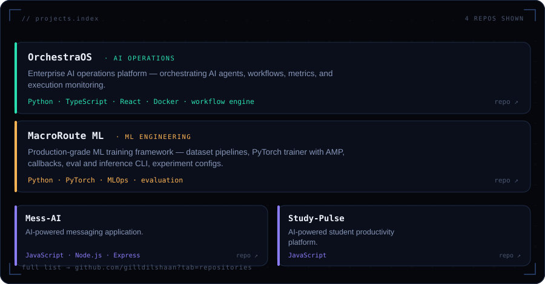
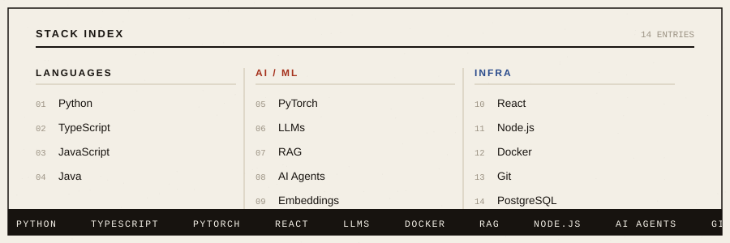
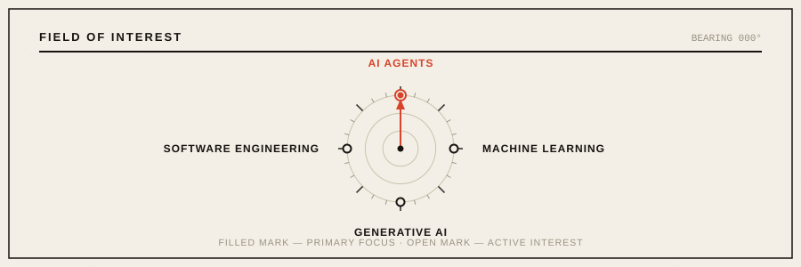

<!-- gilldilshaan · profile readme — "field manual" edition -->
<!-- Commit the assets/ folder together with this README: -->
<!--   hero.svg · terminal.svg · projects.svg · stack.svg · radar.svg · pipeline.svg -->
<!-- NOTE: GitHub strips inline `style="..."` attributes from README HTML — every visual -->
<!-- effect here comes from the SVG assets themselves, not inline CSS. -->
<!-- TODO: replace your.email@example.com with your real address (connect line below) -->

  

<a href="https://portfolio-eta-gold-68.vercel.app/"><b>PORTFOLIO</b></a>
&nbsp;·&nbsp;
<a href="https://www.linkedin.com/in/dilshaangill/"><b>LINKEDIN</b></a>
&nbsp;·&nbsp;
<a href="https://github.com/gilldilshaan"><b>GITHUB</b></a>
&nbsp;·&nbsp;
<a href="mailto:your.email@example.com"><b>EMAIL</b></a>

 

  

 

  

<a href="https://github.com/gilldilshaan/orchestraos">OrchestraOS</a> ·
<a href="https://github.com/gilldilshaan/macroroute-ml">MacroRoute ML</a> ·
<a href="https://github.com/gilldilshaan/Mess-AI">Mess-AI</a> ·
<a href="https://github.com/gilldilshaan/Study-Pulse-">Study-Pulse</a> ·
<a href="https://github.com/gilldilshaan?tab=repositories">view all repositories →</a>

 

  

 

<picture>
  <source media="(prefers-color-scheme: dark)" srcset="https://github-readme-stats.vercel.app/api?username=gilldilshaan&show_icons=true&hide_border=true&bg_color=17130F&title_color=D8432A&icon_color=D8432A&text_color=F3EFE6&disable_animations=true">
  
</picture>
<picture>
  <source media="(prefers-color-scheme: dark)" srcset="https://streak-stats.demolab.com?user=gilldilshaan&theme=dark&hide_border=true&background=17130F&stroke=5C5548&ring=D8432A&fire=D8432A&currStreakNum=F3EFE6&sideNums=CBC2AC&currStreakLabel=D8432A&sideLabels=CBC2AC&dates=9A9182">
  
</picture>

<picture>
  <source media="(prefers-color-scheme: dark)" srcset="https://github-readme-activity-graph.vercel.app/graph?username=gilldilshaan&bg_color=17130F&color=CBC2AC&line=D8432A&point=F3EFE6&area=true&hide_border=true&title_color=D8432A&radius=0">
  
</picture>

 

  

 

  

 

<a href="https://portfolio-eta-gold-68.vercel.app/">Portfolio</a> ·
<a href="https://www.linkedin.com/in/dilshaangill/">LinkedIn</a> ·
<a href="https://github.com/gilldilshaan">GitHub</a> ·
<a href="mailto:your.email@example.com">Email</a>

Chandigarh, IN — © 2026 Dilshaan Gill
