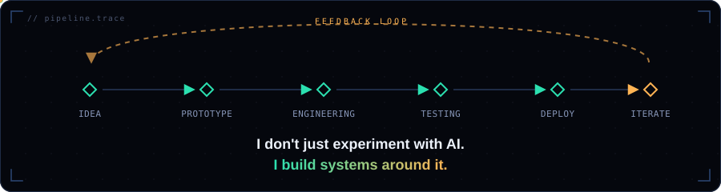

<!-- gilldilshaan · profile readme -->
<!-- IMPORTANT: commit the assets/ folder together with this README (hero.svg, terminal.svg, pipeline.svg) -->


<p align="center">

</p>

<div align="center" style="background:#0F1522;border:1px solid #24355A;border-radius:14px;padding:14px 10px;max-width:860px">
<a href="https://portfolio-eta-gold-68.vercel.app/" style="display:inline-block;background:#2E5BFF;border:1px solid #2E5BFF;border-radius:9px;padding:9px 22px;margin:3px;color:#FFFFFF;font-size:13px;font-weight:600;text-decoration:none">Portfolio</a>
<a href="https://www.linkedin.com/in/dilshaangill/" style="display:inline-block;background:#141D31;border:1px solid #2A3A5C;border-radius:9px;padding:9px 22px;margin:3px;color:#E9EEF7;font-size:13px;font-weight:600;text-decoration:none">LinkedIn</a>
<a href="https://github.com/gilldilshaan" style="display:inline-block;background:#141D31;border:1px solid #2A3A5C;border-radius:9px;padding:9px 22px;margin:3px;color:#E9EEF7;font-size:13px;font-weight:600;text-decoration:none">GitHub</a>
<a href="mailto:gilldilshaan7@gmail.com" style="display:inline-block;background:#141D31;border:1px solid #2A3A5C;border-radius:9px;padding:9px 22px;margin:3px;color:#E9EEF7;font-size:13px;font-weight:600;text-decoration:none">Email</a>
</div>

<br>

<p align="center">

</p>

<br>

<p align="center"><code style="font-size:12px;letter-spacing:.28em"><span style="color:#5B8CFF">#</span> <span style="color:#6E7B91">projects</span></code></p>

<div align="center" style="background:linear-gradient(120deg,#111B33 0%,#0F1522 55%);border:1px solid #24355A;border-left:3px solid #5B8CFF;border-radius:14px;padding:26px 28px;text-align:left;max-width:840px">
<p style="margin:0 0 8px;color:#E9EEF7;font-size:17px;font-weight:700;letter-spacing:.03em">OrchestraOS&nbsp;&nbsp;<span style="color:#5B8CFF;font-family:ui-monospace,SFMono-Regular,Menlo,monospace;font-size:11px;letter-spacing:.14em">· AI OPERATIONS</span></p>
<p style="margin:0 0 14px;color:#8CA3C7;font-size:14px;line-height:1.65">Enterprise AI operations platform — orchestrating AI agents, workflows, metrics, and execution monitoring.</p>
<p style="margin:0;font-family:ui-monospace,SFMono-Regular,Menlo,monospace;font-size:12px;color:#5B8CFF">Python · TypeScript · React · Docker · workflow engine&nbsp;&nbsp;<span style="color:#2B3852">│</span>&nbsp;&nbsp;<a href="https://github.com/gilldilshaan/orchestraos" style="color:#8B7CF8;text-decoration:none">github ↗</a></p>
</div>

<br>

<div align="center" style="background:#0F1522;border:1px solid #24355A;border-left:3px solid #8B7CF8;border-radius:14px;padding:26px 28px;text-align:left;max-width:840px">
<p style="margin:0 0 8px;color:#E9EEF7;font-size:17px;font-weight:700;letter-spacing:.03em">MacroRoute ML&nbsp;&nbsp;<span style="color:#8B7CF8;font-family:ui-monospace,SFMono-Regular,Menlo,monospace;font-size:11px;letter-spacing:.14em">· ML ENGINEERING</span></p>
<p style="margin:0 0 14px;color:#8CA3C7;font-size:14px;line-height:1.65">Production-grade ML training framework — dataset pipelines, PyTorch trainer with AMP, callbacks, eval &amp; inference CLI, experiment configs.</p>
<p style="margin:0;font-family:ui-monospace,SFMono-Regular,Menlo,monospace;font-size:12px;color:#8B7CF8">Python · PyTorch · MLOps · evaluation&nbsp;&nbsp;<span style="color:#2B3852">│</span>&nbsp;&nbsp;<a href="https://github.com/gilldilshaan/macroroute-ml" style="color:#8B7CF8;text-decoration:none">github ↗</a></p>
</div>

<br>

<table align="center" width="860">
<tr>
<td width="50%" style="background:#0F1522;border:1px solid #24355A;border-radius:14px;padding:20px 24px;vertical-align:top">
<p style="margin:0 0 6px;color:#E9EEF7;font-size:15px;font-weight:700">Mess-AI</p>
<p style="margin:0 0 12px;color:#8CA3C7;font-size:13px;line-height:1.6">AI-powered messaging application.</p>
<p style="margin:0;font-family:ui-monospace,SFMono-Regular,Menlo,monospace;font-size:12px;color:#8CA3C7">JavaScript · Node.js · Express&nbsp;&nbsp;<a href="https://github.com/gilldilshaan/Mess-AI" style="color:#5B8CFF;text-decoration:none">github ↗</a></p>
</td>
<td width="50%" style="background:#0F1522;border:1px solid #24355A;border-radius:14px;padding:20px 24px;vertical-align:top">
<p style="margin:0 0 6px;color:#E9EEF7;font-size:15px;font-weight:700">Study-Pulse</p>
<p style="margin:0 0 12px;color:#8CA3C7;font-size:13px;line-height:1.6">AI-powered student productivity platform.</p>
<p style="margin:0;font-family:ui-monospace,SFMono-Regular,Menlo,monospace;font-size:12px;color:#8CA3C7">JavaScript&nbsp;&nbsp;<a href="https://github.com/gilldilshaan/Study-Pulse-" style="color:#5B8CFF;text-decoration:none">github ↗</a></p>
</td>
</tr>
</table>

<p align="center" style="font-size:13px;margin-top:14px"><a href="https://github.com/gilldilshaan?tab=repositories" style="text-decoration:none">view all repositories →</a></p>

<br>

<p align="center"><code style="font-size:12px;letter-spacing:.28em"><span style="color:#5B8CFF">#</span> <span style="color:#6E7B91">stack</span></code></p>

```yaml
# stack.yaml
languages: [python, java, javascript, typescript]
frontend:  [react, next.js, tailwind css]
backend:   [node.js, express, rest apis]
ai_ml:     [pytorch, llms, rag, ai agents, embeddings, vector search]
infra:     [git, github, docker, vercel, mysql, postgresql]
```

<br>

<p align="center"><code style="font-size:12px;letter-spacing:.28em"><span style="color:#5B8CFF">#</span> <span style="color:#6E7B91">metrics</span></code></p>

<p align="center">
<picture>
  <source media="(prefers-color-scheme: dark)" srcset="https://github-readme-stats.vercel.app/api?username=gilldilshaan&show_icons=true&hide_border=true&bg_color=0D1117&title_color=5B8CFF&icon_color=5B8CFF&text_color=C9D1D9&disable_animations=true">
  
</picture>
<picture>
  <source media="(prefers-color-scheme: dark)" srcset="https://streak-stats.demolab.com?user=gilldilshaan&theme=dark&hide_border=true&background=0F1522&stroke=24355A&ring=5B8CFF&fire=8B7CF8&currStreakNum=E9EEF7&sideNums=8CA3C7&currStreakLabel=5B8CFF&sideLabels=8CA3C7&dates=6E7B91">
  
</picture>
</p>

<p align="center">
<picture>
  <source media="(prefers-color-scheme: dark)" srcset="https://github-readme-activity-graph.vercel.app/graph?username=gilldilshaan&bg_color=0F1522&color=8CA3C7&line=5B8CFF&point=8B7CF8&area=true&hide_border=true&title_color=5B8CFF&radius=14">
  
</picture>
</p>

<br>

<p align="center"><code style="font-size:12px;letter-spacing:.28em"><span style="color:#5B8CFF">#</span> <span style="color:#6E7B91">exploring</span></code></p>

```
ai agents        · tool calling · multi-agent systems · memory · autonomous workflows
machine learning · training · evaluation · inference · mlops
generative ai    · rag · embeddings · vector databases · llm applications
engineering      · full-stack · apis · system design · open source
```

<br>

<p align="center"><code style="font-size:12px;letter-spacing:.28em"><span style="color:#5B8CFF">#</span> <span style="color:#6E7B91">philosophy</span></code></p>

<p align="center">

</p>

<br>

<p align="center"><code style="font-size:12px;letter-spacing:.28em"><span style="color:#5B8CFF">#</span> <span style="color:#6E7B91">connect</span></code></p>

<p align="center">
<a href="https://portfolio-eta-gold-68.vercel.app/" style="display:inline-block;background:#2E5BFF;border:1px solid #2E5BFF;border-radius:9px;padding:9px 22px;margin:3px;color:#FFFFFF;font-size:13px;font-weight:600;text-decoration:none">Portfolio</a>
<a href="https://www.linkedin.com/in/dilshaangill/" style="display:inline-block;background:#141D31;border:1px solid #2A3A5C;border-radius:9px;padding:9px 22px;margin:3px;color:#E9EEF7;font-size:13px;font-weight:600;text-decoration:none">LinkedIn</a>
<a href="https://github.com/gilldilshaan" style="display:inline-block;background:#141D31;border:1px solid #2A3A5C;border-radius:9px;padding:9px 22px;margin:3px;color:#E9EEF7;font-size:13px;font-weight:600;text-decoration:none">GitHub</a>
<a href="mailto:gilldilshaan7@gmail.com" style="display:inline-block;background:#141D31;border:1px solid #2A3A5C;border-radius:9px;padding:9px 22px;margin:3px;color:#E9EEF7;font-size:13px;font-weight:600;text-decoration:none">Email</a>
</p>

<br>

<div align="center" style="background:linear-gradient(120deg,#111B33 0%,#0F1522 55%);border:1px solid #24355A;border-radius:14px;padding:26px 24px;max-width:840px">
<p style="margin:0;color:#E9EEF7;font-size:17px;font-weight:800;letter-spacing:.1em">BUILD SOMETHING THAT MATTERS<span style="color:#5B8CFF">.</span></p>
</div>

<br>

<p align="center"><sub style="color:#6E7B91;font-family:ui-monospace,SFMono-Regular,Menlo,monospace">© 2026 Dilshaan Gill</sub></p>
